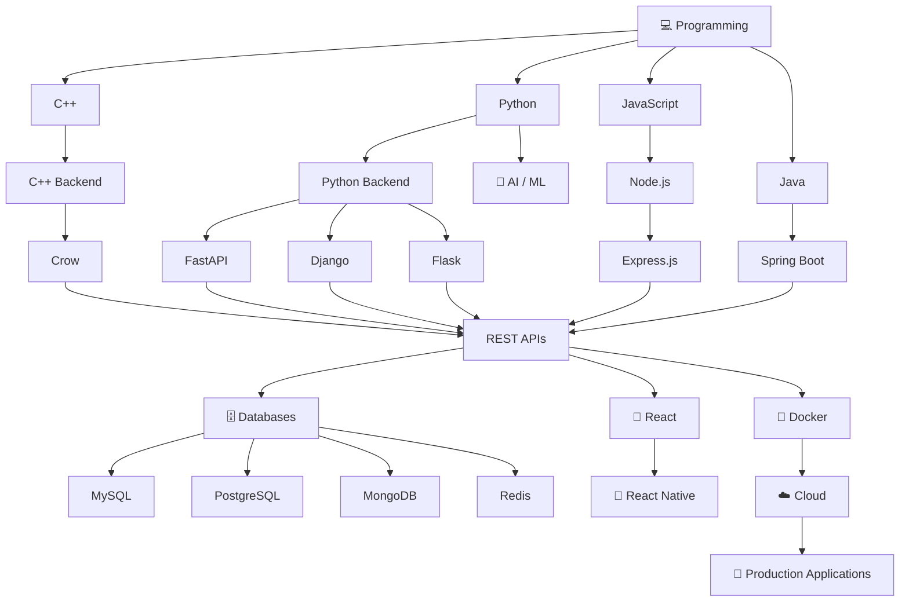

<!-- ===================== HEADER ===================== -->

<h1 align="center">
  
</h1>

<p align="center">
  
  
</p>

<h3 align="center">
  🚀 Backend Developer &nbsp; | &nbsp; 🤖 AI/ML Enthusiast
  <br>
  ⚡ Building Scalable APIs, Web Applications & Intelligent Systems
</h3>

---

<!-- ===================== BANNER ===================== -->

<p align="center">
  
</p>

---

## 👨‍💻 About Me

<table>
<tr>
<td width="55%">


</td>

<td width="45%">

* 🎓 **B.Tech CSE (AI/ML) Graduate — 2026**
* 💻 Backend & Full Stack Developer
* 🚀 Building scalable REST APIs & web applications
* 🤖 Interested in Artificial Intelligence & Machine Learning
* 🐍 Python Backend Development
* ☕ Java Backend Development
* 🟢 Node.js Backend Development
* ⚡ C++ Backend Development
* 📱 React & React Native Development
* 🗄️ SQL & NoSQL Database Development
* 🐳 Docker & Cloud Technologies
* 🔥 Passionate about building real-world applications

</td>
</tr>
</table>

---

## 🛠️ Tech Stack

### 🚀 Backend Development

<p align="center">
  
</p>

| Language      | Framework                | Used For                       |
| ------------- | ------------------------ | ------------------------------ |
| 🟢 JavaScript | **Node.js + Express.js** | REST APIs & Web Applications   |
| ☕ Java        | **Spring Boot**          | Enterprise Backend & REST APIs |
| 🐍 Python     | **FastAPI**              | High-Performance APIs          |
| 🐍 Python     | **Django**               | Web Applications               |
| 🐍 Python     | **Flask**                | APIs & Microservices           |
| ⚡ C++         | **Crow**                 | High-Performance Backend APIs  |

---

### 🎨 Frontend Development

<p align="center">
  
</p>

| Technology   | Purpose                       |
| ------------ | ----------------------------- |
| HTML5        | Web Structure                 |
| CSS3         | Styling & Responsive UI       |
| JavaScript   | Web Development               |
| React.js     | Modern Web Applications       |
| React Native | Android / Mobile Applications |

---

### 🤖 Machine Learning & AI

<p align="center">
  
</p>

**Technologies & Concepts**

* Machine Learning
* Deep Learning
* Natural Language Processing
* Computer Vision
* Neural Networks
* Transformers
* BERT / GPT
* Scikit-learn
* TensorFlow
* PyTorch
* OpenCV

---

## 💾 Databases

<p align="center">
  
</p>

| Database       | Type                              |
| -------------- | --------------------------------- |
| **MySQL**      | Relational Database               |
| **PostgreSQL** | Relational Database               |
| **MongoDB**    | NoSQL Database                    |
| **Redis**      | In-Memory Database / Caching      |
| **SQLite**     | Embedded Database                 |
| **Firebase**   | Cloud Database & Backend Services |

### 🔑 Database Skills

* Database Design
* CRUD Operations
* Complex SQL Queries
* Joins
* Subqueries
* CTEs
* Window Functions
* Indexing
* Query Optimization
* Transactions
* ACID Properties
* Database Normalization

---

## 💻 Programming Languages

<p align="center">
  
</p>

| Language          | Focus                                    |
| ----------------- | ---------------------------------------- |
| ⚡ **C++**         | Backend Development & System Programming |
| 🐍 **Python**     | Backend, AI/ML & Automation              |
| ☕ **Java**        | Backend Development & Spring Boot        |
| 🟨 **JavaScript** | Frontend & Node.js                       |
| 🔷 **TypeScript** | Modern JavaScript Development            |
| 🗄️ **SQL**       | Database Development                     |

---

## 📱 Mobile Development

<p align="center">
  
</p>

### React Native

* Android Application Development
* REST API Integration
* Authentication
* CRUD Applications
* API-based Mobile Applications
* React Native Navigation

---

## 🛠️ DevOps & Cloud

<p align="center">
  
</p>

| Technology    | Purpose                          |
| ------------- | -------------------------------- |
| 🐳 **Docker** | Containerization                 |
| ☁️ **AWS**    | Cloud Infrastructure             |
| 🐧 **Linux**  | Server & Development Environment |
| 🔧 **Git**    | Version Control                  |
| 🐙 **GitHub** | Code Hosting & Collaboration     |
| 🌐 **Nginx**  | Web Server & Reverse Proxy       |

---

## 🔌 API & Development Tools

<p align="center">
  
</p>

* REST API Development
* API Testing with Postman
* JWT Authentication
* Middleware
* CRUD Operations
* Pagination
* Search & Filtering
* Sorting
* File Upload
* API Integration
* Authentication & Authorization

---

## 🚀 What I Build

```text
        💻 Frontend
            │
            ▼
    ┌─────────────────┐
    │ React / React   │
    │ Native          │
    └────────┬────────┘
             │
             ▼
        🔌 REST APIs
             │
    ┌────────┼─────────┐
    ▼        ▼         ▼
 Node.js   Spring     Python
 Express   Boot       FastAPI
    │        │         │
    └────────┼─────────┘
             ▼
       🗄️ Databases
             │
    ┌────────┼─────────┐
    ▼        ▼         ▼
 MySQL   PostgreSQL  MongoDB
             │
             ▼
        ☁️ Cloud / Docker
```

---

## 🎯 My Development Journey



---

## 📊 GitHub Statistics

<p align="center">
  

  
</p>

<p align="center">
  

  
</p>

---

## 🔥 Activity Graph

<p align="center">
  
</p>

---

## 🌐 Connect With Me

<p align="center">

<a href="https://www.linkedin.com/in/shivam-mishra-b47739279/" target="_blank">
  
</a>

<a href="https://www.instagram.com/shivam_mishrasm/" target="_blank">
  
</a>

<a href="https://github.com/shivam-mishra1423" target="_blank">
  
</a>

</p>

---

<h3 align="center">
  🚀 Build • Learn • Deploy • Repeat
</h3>

<p align="center">
  <i>"Turning ideas into scalable software and intelligent systems."</i>
</p>

<p align="center">
  ⭐ Thanks for visiting my profile!
</p>
