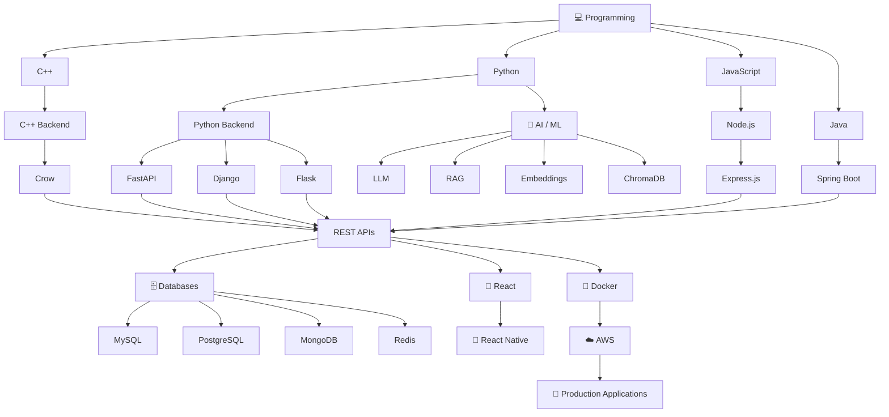

<!-- ===================================================== -->

<!--                    PROFILE HEADER                     -->

<!-- ===================================================== -->

<h1 align="center">
  
</h1>

<p align="center">
  

  
</p>

<h3 align="center">
  🚀 Backend Developer &nbsp; | &nbsp; 💻 Full Stack Developer &nbsp; | &nbsp; 🤖 AI/ML Enthusiast
</h3>

<p align="center">
  ⚡ Building scalable APIs, modern web applications, mobile applications & intelligent systems
</p>

---

<!-- ===================================================== -->

<!--                      BANNER                           -->

<!-- ===================================================== -->

<p align="center">
  
</p>

---

# 👨‍💻 About Me

<table>
<tr>

<td width="55%">


</td>

<td width="45%">

* 🎓 **B.Tech CSE (AI/ML) Graduate — 2026**
* 💻 Backend & Full Stack Developer
* 🚀 Building scalable REST APIs
* 🤖 Interested in AI, ML & LLM applications
* 🟢 Node.js & Express.js Development
* ☕ Java & Spring Boot Development
* 🐍 Python Backend Development
* ⚡ C++ Backend Development
* 🎨 React Web Development
* 📱 React Native Android Development
* 🗄️ SQL & NoSQL Databases
* 🔐 Authentication & Authorization
* 🐳 Docker & Cloud Technologies
* 🔥 Passionate about building real-world applications

</td>

</tr>
</table>

---

# 🧰 My Tech Stack

## 🚀 Backend Development

<p align="center">
  
</p>

| Language      | Framework                | Purpose                        |
| ------------- | ------------------------ | ------------------------------ |
| 🟢 JavaScript | **Node.js + Express.js** | REST APIs & Web Applications   |
| ☕ Java        | **Spring Boot**          | Enterprise Backend & REST APIs |
| 🐍 Python     | **FastAPI**              | High-Performance APIs          |
| 🐍 Python     | **Django**               | Web Applications               |
| 🐍 Python     | **Flask**                | APIs & Microservices           |
| ⚡ C++         | **Crow**                 | High-Performance Backend APIs  |

---

# 🤖 AI / LLM Development

<p align="center">
  
</p>

<p align="center">


</p>

### 🧠 AI Technologies

* Large Language Models (LLMs)
* Generative AI
* Retrieval Augmented Generation (RAG)
* Vector Databases
* ChromaDB
* Embeddings
* Prompt Engineering
* Transformers
* Natural Language Processing
* Machine Learning
* Deep Learning
* Computer Vision

---

# 🎨 Frontend Development

<p align="center">
  
</p>

| Technology     | Purpose                          |
| -------------- | -------------------------------- |
| **HTML5**      | Web Structure                    |
| **CSS3**       | Styling & Responsive UI          |
| **JavaScript** | Web Development                  |
| **TypeScript** | Type-Safe JavaScript Development |
| **React.js**   | Modern Web Applications          |
| **Next.js**    | Full Stack React Applications    |

---

# 📱 Android / Mobile Development

<p align="center">
  
</p>

### React Native

* Android Application Development
* REST API Integration
* Authentication
* CRUD Applications
* API Integration
* Navigation
* Mobile UI Development
* Backend Integration

---

# 🗄️ Database Technologies

<p align="center">
  
</p>

<p align="center">


</p>

| Database       | Type                       |
| -------------- | -------------------------- |
| **MySQL**      | SQL / Relational Database  |
| **PostgreSQL** | SQL / Relational Database  |
| **MongoDB**    | NoSQL Database             |
| **Redis**      | In-Memory Database / Cache |
| **SQLite**     | Embedded SQL Database      |
| **Firebase**   | Cloud Database             |
| **ChromaDB**   | Vector Database            |

### 🔑 Database Skills

* Database Design
* CRUD Operations
* SQL Queries
* Complex Joins
* Subqueries
* CTEs
* Window Functions
* Indexing
* Query Optimization
* Transactions
* ACID Properties
* Database Normalization
* NoSQL Data Modeling
* Caching

---

# 🔌 API Development

<p align="center">


</p>

### 🔥 Backend Concepts

* REST API Development
* CRUD APIs
* Authentication
* Authorization
* JWT
* OAuth
* Middleware
* File Upload
* Pagination
* Search
* Filtering
* Sorting
* Validation
* Error Handling
* API Testing
* WebSockets

---

# 💻 Programming Languages

<p align="center">
  
</p>

| Language          | Focus                        |
| ----------------- | ---------------------------- |
| ⚡ **C++**         | Backend & System Programming |
| 🐍 **Python**     | Backend, AI/ML & Automation  |
| ☕ **Java**        | Backend & Spring Boot        |
| 🟨 **JavaScript** | Frontend & Node.js           |
| 🔷 **TypeScript** | Modern Web Development       |
| 🗄️ **SQL**       | Database Development         |

---

# 🐳 DevOps & Cloud

<p align="center">
  
</p>

| Technology        | Purpose                          |
| ----------------- | -------------------------------- |
| 🐳 **Docker**     | Containerization                 |
| ☁️ **AWS**        | Cloud Infrastructure             |
| 🐧 **Linux**      | Server & Development Environment |
| 🔧 **Git**        | Version Control                  |
| 🐙 **GitHub**     | Code Hosting & Collaboration     |
| 🌐 **Nginx**      | Web Server & Reverse Proxy       |
| ☸️ **Kubernetes** | Container Orchestration          |

---

# 🧩 Complete Technology Stack

<p align="center">


<br><br>


<br><br>


<br><br>


</p>

### 🤖 AI / Data Stack

<p align="center">


<br><br>


</p>

---

# 🚀 What I Build

```text
                         👨‍💻 Shivam
                             │
              ┌──────────────┼──────────────┐
              │              │              │
              ▼              ▼              ▼
         🎨 Frontend     🚀 Backend      🤖 AI / ML
              │              │              │
          React          Node.js          Python
          Next.js        Express          LLM
          React Native   Spring Boot      RAG
                         FastAPI           Embeddings
                         Django            ChromaDB
                         Flask
                         Crow
              │              │              │
              └──────────────┼──────────────┘
                             ▼
                       🔌 REST APIs
                             │
                             ▼
                       🗄️ Databases
                             │
              ┌──────────────┼──────────────┐
              ▼              ▼              ▼
            SQL           NoSQL          Vector DB
           MySQL         MongoDB         ChromaDB
        PostgreSQL        Redis
              │
              ▼
                       🐳 Docker
                             │
                             ▼
                         ☁️ AWS
                             │
                             ▼
                    🚀 Production Apps
```

---

# 🎯 My Development Journey



---

# 📊 GitHub Statistics

<p align="center">


</p>

<p align="center">


</p>

---

# 🔥 Activity Graph

<p align="center">
  
</p>

---

# 🌐 Connect With Me

<p align="center">

<a href="https://github.com/shivam-mishra1423" target="_blank">
  
</a>

<a href="https://www.linkedin.com/in/shivam-mishra-b47739279/" target="_blank">
  
</a>

<a href="https://www.instagram.com/shivam_mishrasm/" target="_blank">
  
</a>

</p>

---

<h3 align="center">
  🚀 Build • Learn • Deploy • Scale
</h3>

<p align="center">
  <i>"Turning ideas into scalable software and intelligent systems."</i>
</p>

<p align="center">
  ⭐ Thanks for visiting my profile!
</p>
